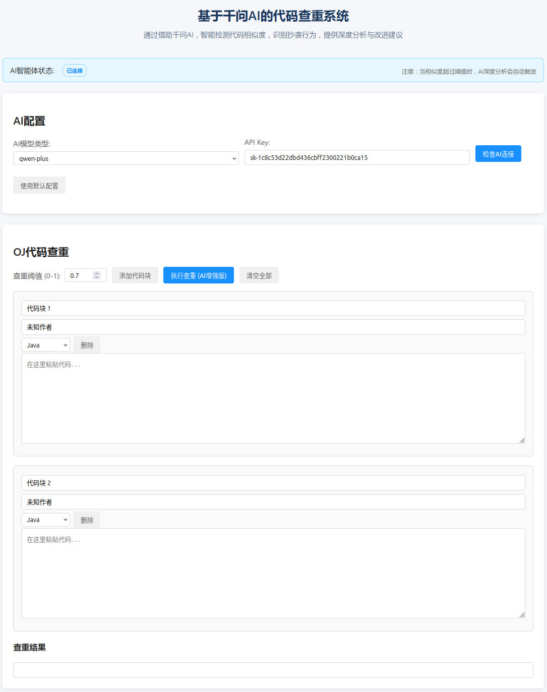
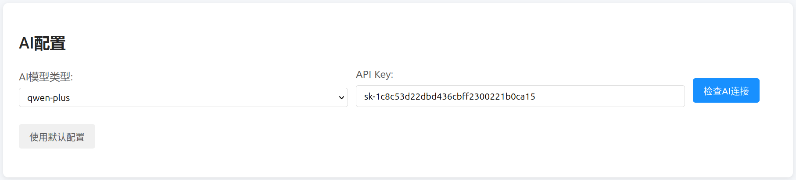
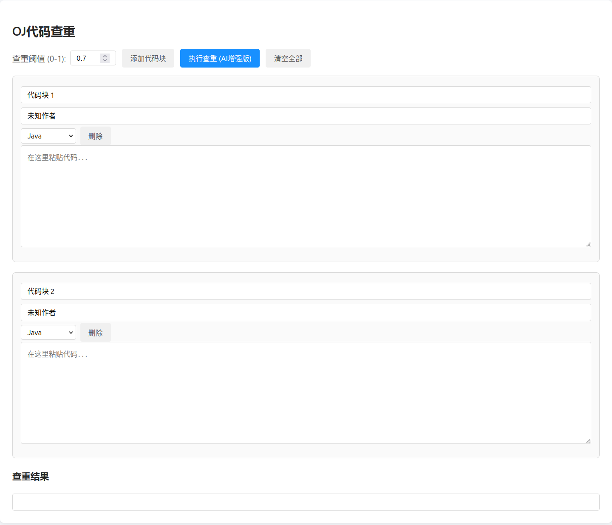

# 千问AI代码查重系统(OJ Code Duplicate Checking)

## 项目展示

总体界面


千问模型选择


批量查重结果展示


## 更新日志

### 版本 1.0_alpha3 (2026-01-04)

**功能改进：**

- 增强了QwenAgent的超时控制机制，防止长时间等待
- 改进了异常处理和错误提示信息
- 优化了API参数传递机制，支持从请求中获取API密钥和模型配置
- 接下来AI查重时不再仅仅直接参考初步查重结果，同时会参考选手代码做出更加合理的评价
- 增加了对大模型API调用的超时处理，避免等待时间过短导致AI还未返回结果，系统直接抛出超时异常的问题

## 项目简介

千问AI代码查重系统结合了传统代码相似度检测和AI增强分析功能，能够有效识别各种抄袭手法，包括变量名修改、结构调整、代码片段重组等。系统通过通义千问API提供深度语义分析和改进建议，为代码评估提供全面支持。该项目基于Hcode OJ平台专门开发查重系统，便于在此基础上进行集成。注意：该项目与原项目无任何联系，只是个人在此基础上添加了这个系统，以求完善防作弊机制

尽管做的不是非常完善，希望大家能够指出其中的问题，我会在休闲之余尽快修复。

后期会考虑使用SpringBoot 3新版本对查重系统进行重构，同时个人也会尝试对Hcode OJ项目使用新版本的Spring Boot框架以及其他新版本框架进行升级。

请支持原作者的Hcode OJ项目，这是原项目的官网：[HOJ官方文档](https://docs.hdoi.cn/)

关于千问模型的种类和价格，请访问[阿里云百炼相关服务](https://bailian.console.aliyun.com/?spm=5176.29597918.J_SEsSjsNv72yRuRFS2VknO.2.15dd7b08MPUkTh&tab=doc#/doc/?type=model&url=2840914)

## 技术栈

### 后端技术

- **OpenJDK 8(Java 8)** - 主要开发语言
- **Spring Boot 2.7.0** - 后端框架，提供RESTful API服务
- **Maven** - 项目构建和依赖管理
- **通义千问API** - 大语言模型接口，提供AI增强分析能力

### 核心功能技术

- **N-gram特征提取** - 用于代码特征向量化
- **Jaccard相似度** - 计算特征集合的相似性
- **编辑距离算法** - 计算代码文本的编辑相似度
- **加权综合评分** - 结合多种相似度指标的综合评分机制

### 项目架构

- 采用标准的Spring Boot分层架构：
  - Controller层：处理HTTP请求，提供REST API接口
  - Service层：实现核心业务逻辑
  - Model层：定义数据模型和实体类
  - Config层：管理系统配置
  - Utils层：提供通用工具类

## 主要特性

1. **智能代码查重分析**：支持变量名标准化、结构相似度计算、多维度评分
2. **多种抄袭类型识别**：变量名替换、结构调整、代码片段重组、注释添加/删除
3. **AI增强语义分析**：通过通义千问提供深度语义分析和教育性反馈
4. **批量代码分析能力**：支持多文件批量对比分析
5. **详细的分析报告和改进建议**：提供针对性的优化建议
6. **灵活的API配置**：支持从请求中动态配置API密钥和模型类型
7. **超时控制机制**：防止AI服务调用长时间阻塞，提高系统稳定性
8. **完善的异常处理**：提供清晰的错误信息和恢复机制
9. **连接检查接口**：支持验证AI服务连接状态
10. **自定义阈值设置**：可根据需求调整抄袭判定的相似度阈值

## 快速开始

### 系统要求

- 建议JDK 1.8
- 建议Maven 3.6~3.8.7(作者构建使用的maven版本)
- 建议使用足够的网络连接（用于访问千问API）

### 千问API-KEY配置方法

要使用千问AI的增强分析功能，您需要配置有效的通义千问API密钥：

在项目根目录下的`src/main/resources/application.yml`文件中，添加或修改以下配置：

```yaml
dashscope:
  api:
    key: "您的API密钥"
  model:
    name: "qwen-turbo"
```

### 项目编译与运行

### 使用Maven直接打包

1. 打开命令行工具，进入项目根目录

   ```bash
   cd c:\Users\qweio\Desktop\OJCodeDuplicateChecking
   ```

2. 执行Maven编译命令

   ```bash
   mvn clean package
   ```

3. 运行应用程序

   ```bash
   java -jar target/codeDuplicateChecking-1.0_alpha2.jar
   ```

### 注意

> 项目暂不包含自动化打包脚本，推荐使用Maven直接打包。

运行成功后，应用将在`http://localhost:8080`上提供服务。

## Docker部署指南

本章节提供了如何使用Docker容器化部署本SpringBoot项目的详细步骤。

### 功能特点

- 基于JDK 8的Alpine轻量镜像
- 支持通过环境变量配置SpringBoot端口
- 多阶段构建减小镜像体积
- 非root用户运行提高安全性

### 构建Docker镜像

在项目根目录执行以下命令构建Docker镜像：

```bash
docker build -t oj-code-duplicate-checking .
```

### 运行Docker容器

#### 默认配置运行

使用默认端口8080运行容器：

```bash
docker run -d -p 8080:8080 --name oj-code-duplicate-container oj-code-duplicate-checking
```

#### 自定义端口运行

通过环境变量`SERVER_PORT`自定义SpringBoot端口：

```bash
# 容器内部使用9090端口，映射到主机9090端口
docker run -d -p 9090:9090 -e SERVER_PORT=9090 --name oj-code-duplicate-container oj-code-duplicate-checking
```

```bash
# 容器内部使用8080端口，映射到主机8888端口
docker run -d -p 8888:8080 --name oj-code-duplicate-container oj-code-duplicate-checking
```

#### 配置API密钥

通过环境变量配置千问API密钥：

```bash
docker run -d -p 8080:8080 \
  -e SERVER_PORT=8080 \
  -e DASHSCOPE_API_KEY=your_api_key_here \
  --name oj-code-duplicate-container oj-code-duplicate-checking
```

### 常用Docker命令

#### 查看容器状态

```bash
docker ps
```

#### 查看容器日志

```bash
docker logs oj-code-duplicate-container
```

#### 进入容器内部

```bash
docker exec -it oj-code-duplicate-container sh
```

#### 停止并删除容器

```bash
docker stop oj-code-duplicate-container
docker rm oj-code-duplicate-container
```

### 注意事项

1. 确保已安装Docker环境
2. 构建镜像前请先确认项目能够正常构建
3. API密钥等敏感信息请通过环境变量传递，避免硬编码
4. 默认端口为8080，可根据需要自定义配置

## 项目结构

```text
.
├── src/                               # 源代码目录
│   ├── main/                          # 主要源码
│   │   ├── java/                      # Java源代码
│   │   │   └── org/codeDuplicateChecking/ # 主包路径
│   │   └── resources/                 # 资源文件
│   │       ├── META-INF/              # 元数据信息
│   │       │   └── spring-configuration-metadata.json # Spring配置元数据
│   │       ├── application.yml        # 应用配置文件
│   │       └── static/                # 静态资源
│   │           └── index.html         # 首页
│   └── test/                          # 测试代码
│       └── java/org/codeDuplicateChecking/ # 测试包路径
├── .gitignore                         # Git忽略配置
├── Dockerfile                         # Docker构建文件
├── LICENSE                            # 许可证文件
├── README.md                          # 项目说明文档
└── pom.xml                            # Maven项目配置文件
```

## API使用说明

### 1. 代码查重核心接口

**说明**: 所有接口都实现了完善的错误处理机制，包括请求参数验证、异常捕获、状态码处理和空值检查等。

#### 1.1 两代码块比较接口

**URL**: `/api/v1/plagiarism/compare/two`  
**方法**: `POST`  
**请求体**:

```json
{
  "codeBlock1": {
    "id": "block1",
    "title": "代码标题1",
    "author": "作者1",
    "language": "Java",
    "code": "public class Test { public static void main(String[] args) { System.out.println(\"Hello World\"); } }"
  },
  "codeBlock2": {
    "id": "block2",
    "title": "代码标题2",
    "author": "作者2",
    "language": "Java",
    "code": "public class Demo { public static void main(String[] args) { System.out.println(\"Hello World\"); } }"
  },
  "threshold": 0.7
}
```

**响应体**:

```json
{
  "similarityScore": 0.95,
  "plagiarism": true,
  "block1Title": "代码标题1",
  "block2Title": "代码标题2",
  "threshold": 0.7,
  "processingTimeMs": 150
}
```

#### 1.2 批量代码比较接口

**URL**: `/api/v1/plagiarism/compare/batch`  
**方法**: `POST`  
**请求体**:

```json
{
  "codeBlocks": [
    {
      "id": "block1",
      "title": "代码标题1",
      "author": "作者1",
      "language": "Java",
      "code": "public class Test { ... }"
    },
    {
      "id": "block2",
      "title": "代码标题2",
      "author": "作者2",
      "language": "Java",
      "code": "public class Demo { ... }"
    },
    {
      "id": "block3",
      "title": "代码标题3",
      "author": "作者3",
      "language": "Java",
      "code": "public class Example { ... }"
    }
  ],
  "threshold": 0.7
}
```

**响应体**:

```json
{
  "totalPairs": 3,
  "plagiarismPairs": 1,
  "maxSimilarityScore": 0.95,
  "avgSimilarityScore": 0.65,
  "threshold": 0.7,
  "processingTimeMs": 250,
  "results": [
    {
      "block1Title": "代码标题1",
      "block2Title": "代码标题2",
      "similarityScore": 0.95,
      "plagiarism": true
    },
    {
      "block1Title": "代码标题1",
      "block2Title": "代码标题3",
      "similarityScore": 0.45,
      "plagiarism": false
    },
    {
      "block1Title": "代码标题2",
      "block2Title": "代码标题3",
      "similarityScore": 0.55,
      "plagiarism": false
    }
  ]
}
```

**注意**:

- 代码块数组至少需要包含2个代码块，否则会返回400错误
- 系统会自动进行参数验证并提供详细的错误信息
- 接口实现了完善的异常处理机制，确保稳定性

##### 1.3 获取支持的编程语言列表

**URL**: `/api/v1/plagiarism/languages`
**方法**: `GET`
**响应体**:

```json
[
  "Java", "Python", "C++", "C", "C#", 
  "JavaScript", "TypeScript", "PHP", "Ruby", 
  "Go", "Swift", "Kotlin", "Rust", "Scala", 
  "HTML", "CSS"
]
```

#### 1.4 获取默认查重配置

**URL**: `/api/v1/plagiarism/config/default`
**方法**: `GET`
**响应体**:

```json
{
  "defaultThreshold": 0.7,
  "minThreshold": 0.0,
  "maxThreshold": 1.0,
  "recommendedThreshold": 0.7,
  "defaultModel": "qwen-plus",
  "timeout": 30000
}
```

### API响应状态码

|状态码|描述|说明|
|------|----|----|
|200|OK|请求成功|
|400|Bad Request|请求参数错误或无效|
|401|Unauthorized|API密钥无效或已过期|
|403|Forbidden|禁止访问该资源|
|404|Not Found|请求的资源不存在|
|429|Too Many Requests|请求过于频繁，超出API速率限制|
|500|Internal Server Error|服务器内部错误|
|502|Bad Gateway|AI服务响应错误|
|503|Service Unavailable|AI服务暂时不可用|

### API调用最佳实践

1. **API密钥管理**:
   - 不要在代码中硬编码API密钥
   - 使用环境变量或配置文件安全存储API密钥
   - 定期轮换API密钥，确保安全性

2. **错误处理**:
   - 实现完善的错误处理逻辑，处理各种HTTP状态码
   - 对于5xx错误，考虑实现重试机制
   - 记录详细的错误日志，便于排查问题

3. **性能优化**:
   - 批量处理代码块，减少API调用次数
   - 合理设置阈值，避免不必要的AI分析
   - 对于大型项目，考虑分模块进行查重

4. **安全措施**:
   - 使用HTTPS协议保护API通信
   - 实现请求限流，防止滥用
   - 验证输入参数，防止注入攻击

5. **使用建议**:
   - 先使用本地查重功能过滤低相似度代码
   - 仅对相似度较高的代码对进行AI增强分析
   - 结合人工审查结果，提高查重准确性

### 2. AI增强分析接口

#### 2.1 AI增强的两段代码比较分析

**URL**: `/api/v1/plagiarism/analysis/compare`  
**方法**: `POST`  
**请求体**:

```json
{
  "codeBlock1": {
    "id": "block1",
    "title": "代码标题1",
    "author": "作者1",
    "language": "Java",
    "code": "public class Test { ... }"
  },
  "codeBlock2": {
    "id": "block2",
    "title": "代码标题2",
    "author": "作者2",
    "language": "Java",
    "code": "public class Demo { ... }"
  },
  "threshold": 0.75,
  "apiKey": "你的API密钥",
  "model": "qwen-plus"
}
```

**响应体**:

```json
{
  "similarityScore": 0.85,
  "plagiarism": true,
  "analysis": "这两段代码在结构和逻辑上高度相似，存在明显的抄袭痕迹...",
  "improvementSuggestions": [
    "建议重构变量命名，提高代码可读性",
    "考虑使用更现代的Java特性替代传统实现"
  ]
}
```

#### 2.2 批量AI增强分析

**URL**: `/api/v1/plagiarism/analysis/batch`  
**方法**: `POST`  
**请求体**:

```json
{
  "codeBlocks": [
    {
      "id": "block1",
      "title": "代码标题1",
      "author": "作者1",
      "language": "Java",
      "code": "public class Test { ... }"
    },
    {
      "id": "block2",
      "title": "代码标题2",
      "author": "作者2",
      "language": "Java",
      "code": "public class Demo { ... }"
    }
  ],
  "threshold": 0.75,
  "apiKey": "你的API密钥",
  "model": "qwen-plus"
}
```

**响应体**:

```json
{
  "totalPairs": 1,
  "plagiarismPairs": 1,
  "maxSimilarityScore": 0.85,
  "avgSimilarityScore": 0.85,
  "threshold": 0.75,
  "processingTimeMs": 1200,
  "results": [
    {
      "block1Title": "代码标题1",
      "block2Title": "代码标题2",
      "similarityScore": 0.85,
      "plagiarism": true,
      "analysis": "这两段代码在结构和逻辑上高度相似..."
    }
  ],
  "batchSummary": "批量分析完成，共发现1对疑似抄袭代码..."
}
```

#### 2.3 获取代码改进建议

**URL**: `/api/v1/plagiarism/analysis/improvement`  
**方法**: `POST`  
**请求体**:

```json
{
  "originalCode": {
    "id": "original",
    "title": "原始代码",
    "author": "原作者",
    "language": "Java",
    "code": "public class Test { ... }"
  },
  "suspiciousCode": {
    "id": "suspicious",
    "title": "可疑代码",
    "author": "可疑作者",
    "language": "Java",
    "code": "public class Demo { ... }"
  },
  "apiKey": "你的API密钥",
  "model": "qwen-plus"
}
```

**响应体**:

```json
{
  "similarityScore": 0.85,
  "plagiarism": true,
  "detailedAnalysis": {
    "similarityTypes": ["结构相似", "逻辑相似"],
    "matchedSections": [
      {
        "originalStartLine": 5,
        "originalEndLine": 15,
        "suspiciousStartLine": 6,
        "suspiciousEndLine": 16,
        "similarity": 0.95
      }
    ],
    "modificationMethods": ["变量名替换", "代码顺序调整"]
  },
  "improvementSuggestions": [
    "建议重构变量命名，使用更具描述性的名称",
    "考虑将重复代码提取为单独的方法或函数",
    "添加适当的注释说明代码逻辑"
  ]
}```

### 3. 千问AI对话接口

#### 3.1 传统对话接口

**URL**: `/api/v1/chat/text`
**方法**: `POST`
**请求体**:

```json
{
  "message": "请解释这段代码的功能：public class Test { ... }",
  "systemPrompt": "你是一位专业的编程助手，请详细解释代码功能。",
  "apiKey": "你的API密钥",
  "model": "qwen-plus"
}
```

**响应体**:

```json
{
  "response": "这段代码定义了一个名为Test的Java类...",
  "model": "qwen-plus",
  "processingTimeMs": 800
}
```

#### 3.2 流式对话接口

**URL**: `/api/v1/chat/stream`
**方法**: `POST`
**请求体**:

```json
{
  "message": "请解释这段代码的功能：public class Test { ... }",
  "systemPrompt": "你是一位专业的编程助手，请详细解释代码功能。",
  "apiKey": "你的API密钥",
  "model": "qwen-plus"
}
```

**响应**:

流式返回JSON数据，每个数据块包含部分响应内容：

```json
{"content": "这段代码"}
{"content": "定义了一个"}
{"content": "名为Test的"}
{"content": "Java类..."}
{"content": "\n\n该类包含..."}
```

**注意**: 流式接口需要客户端支持处理流式响应。

### 4. AI服务连接检查接口

#### 4.1 AI连接状态检查

**URL**: `/api/v1/plagiarism/analysis/check-connection`
**方法**: `POST`
**请求体**:

```json
{
  "apiKey": "你的API密钥",
  "model": "qwen-plus"
}
```

**响应体**:

```json
{
  "connected": true,
  "message": "千问AI服务连接成功",
  "model": "qwen-plus",
  "version": "2.0"
}
```

**错误响应示例**:

```json
{
  "connected": false,
  "message": "API密钥无效或已过期",
  "errorCode": "INVALID_API_KEY"
}
```

## 技术原理

### 1. 代码预处理

- 移除注释和空白字符
- 变量名标准化（替换为占位符）
- 代码结构特征提取

### 2. 相似度计算

- **Jaccard相似度**：基于n-gram的文本相似度
- **编辑距离**：计算代码序列的编辑操作数
- **结构相似度**：分析代码语法结构的相似性
- **加权融合**：多维度评分的加权组合

### 3. AI增强分析

使用千问AI提供：

- **代码语义层面的深度分析**：理解代码的含义和功能
- **教育性反馈和改进建议**：为开发者提供代码质量和优化方向
- **抄袭模式的详细识别**：识别不同类型的抄袭行为

## 建议阈值设置

- **0.9及以上**：极高相似度，几乎可以确定为直接复制
- **0.7-0.9**：高度相似，可能存在大量复制或改写
- **0.5-0.7**：中度相似，需要进一步人工审查
- **0.3-0.5**：低度相似，可能有共同的实现思路
- **0.3以下**：极低相似度，基本可以确定为独立实现

## 使用时的注意事项

1. 代码查重结果仅供参考，建议重要场景下进行人工复核
2. 对于短代码或常见算法实现，可能会出现较高的相似度
3. 支持的编程语言有限，其他语言的查重准确度可能较低
4. 复杂项目的代码查重需要考虑更多因素，如项目结构、设计模式等

## 许可证

本项目采用MIT许可证。详细条款请参阅项目根目录中的[LICENSE文件](LICENSE)。

MIT License

Copyright (c) 2024 AITA Team

Permission is hereby granted, free of charge, to any person obtaining a copy
of this software and associated documentation files (the "Software"), to deal
in the Software without restriction, including without limitation the rights
to use, copy, modify, merge, publish, distribute, sublicense, and/or sell
copies of the Software, and to permit persons to whom the Software is
furnished to do so, subject to the following conditions:

The above copyright notice and this permission notice shall be included in all
copies or substantial portions of the Software.
